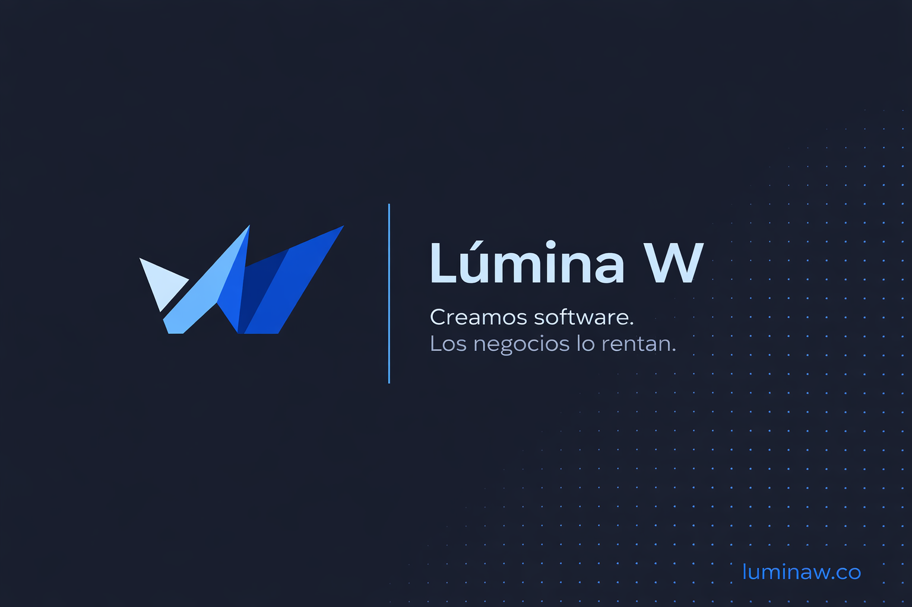

<h1 align="left">
  
  Lúmina W • Landing Page
</h1>



> Marketing site for **Lúmina W S.A.S**, a Colombian software startup that builds custom software (Discovery → Build → Launch) and operates SaaS products like TerraCore. Editorial, sober, square-edged design system on top of Astro 6 + Tailwind v4 + TypeScript. Static build, Netlify-hosted, GA4 with consent gating, full SEO + `llms.txt` for AI crawlers.

[](https://luminaw.co)
[](https://blog.luminaw.co)
[](https://terracoreapp.co)

## Table of contents

- [Stack](#stack)
- [Local setup](#local-setup)
  - [npm scripts](#npm-scripts)
- [Environment variables](#environment-variables)
- [Architecture](#architecture)
  - [Page composition](#page-composition)
  - [Design system](#design-system)
  - [Browser scripts](#browser-scripts)
  - [Legal pages](#legal-pages)
- [Testing](#testing)
- [Deploying to Netlify](#deploying-to-netlify)
  - [One-time setup](#one-time-setup)
  - [What's already in the repo](#whats-already-in-the-repo)
  - [Headers + cache](#headers--cache)
  - [Analytics consent](#analytics-consent)
- [SEO surface](#seo-surface)
- [Troubleshooting](#troubleshooting)
- [Roadmap / known gaps](#roadmap--known-gaps)
- [License](#license)
- [Contact](#contact)

Related docs: [CLAUDE.md](./CLAUDE.md) · [AGENTS.md](./AGENTS.md) · [DESIGN.md](./DESIGN.md)

## Stack

| Layer        | Choice                                                                 |
| ------------ | ---------------------------------------------------------------------- |
| Framework    | Astro 6 (static output), TypeScript 5 (strict via `astro/tsconfigs`)   |
| UI           | Astro components + minimal islands. React 19 integration installed.    |
| Styling      | Tailwind CSS v4 (`@tailwindcss/vite`) + a single `global.css` BEM file |
| Type         | Cabinet Grotesk (display) + Switzer (body), via Fontshare CDN          |
| Form         | Formspree (`xpqovooa`)                                                 |
| Analytics    | Google Analytics 4, consent-gated by the cookies banner                |
| SEO          | `@astrojs/sitemap`, JSON-LD `@graph`, `robots.txt`, `llms.txt`         |
| Hosting      | Netlify (`netlify.toml` + `public/_headers` + `public/_redirects`)     |
| Tooling      | Prettier (+ prettier-plugin-astro, prettier-plugin-tailwindcss), ESLint 10 with `eslint-plugin-astro` |

## Local setup

```bash
git clone git@github.com:wavival/LP-Lumina-W.git
cd LP-Lumina-W
npm install
npm run dev                      # http://localhost:4321
```

No env file required for `npm run dev`, the contact form posts to a public Formspree endpoint, GA4 only loads after user consent, and the site has no backend.

### npm scripts

| Script                | What it does                                                          |
| --------------------- | --------------------------------------------------------------------- |
| `npm run dev`         | Astro dev server with HMR (port 4321)                                 |
| `npm run build`       | Static build to `dist/` + generates `sitemap-index.xml`               |
| `npm run preview`     | Serve the built `dist/` locally                                       |
| `npm run astro`       | Astro CLI passthrough (e.g. `npm run astro -- add <integration>`)     |
| `npm run format`      | `prettier --write .`                                                  |
| `npm run format:check`| `prettier --check .` (CI gate)                                        |

Node `>= 22.12.0` is enforced by `package.json` and pinned in `netlify.toml`.

## Environment variables

No `.env` is required out of the box. Third-party IDs that *are* currently hard-coded:

| Where                          | Value                            | Notes                                                              |
| ------------------------------ | -------------------------------- | ------------------------------------------------------------------ |
| `src/scripts/cookies.ts`       | GA4 `G-RBNC0VP6D3`               | Loaded only after the user clicks **Accept** on the cookies banner |
| `src/scripts/contact.ts`       | Formspree ID `xpqovooa`          | POSTs `{ name, company, email, message }` as JSON                  |
| `src/components/ui/NavBar.astro`, `Footer.astro` | WhatsApp `+57 310 828 3088` | Floating FAB + footer social icons                                 |

If you migrate any of these to env, prefix with `PUBLIC_` so Astro exposes the value to client bundles, and update the matching reference in the script.

## Architecture

```
src/
├── pages/
│   ├── index.astro          composes the landing in nav-anchored order
│   ├── terms.astro          /terms      · 10 numbered sections + sticky TOC
│   ├── privacy.astro        /privacy    · 10 numbered sections + sticky TOC
│   ├── cookies.astro        /cookies    ·  8 numbered sections + sticky TOC
│   └── 404.astro
├── layouts/
│   └── Layout.astro         <head> SEO/OG/Schema.org @graph, body shell,
│                            Loader, NavBar, Footer, CookiesBanner, WA FAB,
│                            cursor-glow div, global script imports
├── components/
│   ├── ui/                  NavBar, Footer, CookiesBanner, Loader, Icon,
│   │                        Button, Link
│   └── sections/            Hero, Problem, Agitation (stakes-band),
│                            Marquee, Solution (services), Process,
│                            Manifesto, TerraCore, WhyUs, FAQ, Contact
├── scripts/                 nav · cookies · cursor · scrollAnimations ·
│                            faq · contact · loader · analytics
├── styles/
│   └── global.css           single source of truth: tokens, @theme,
│                            element resets, every component's BEM CSS
└── styles assets in public/ brand/, icons/, images/, videos/
```

### Page composition

`src/pages/index.astro` mounts sections in a fixed order. Each section that appears in the navbar has an `id` that matches a nav anchor and a `.ghost-num` (the giant translucent number top-right of the section header). **Ghost-nums encode navbar order, not section order**: `Hero 01 · Problem 02 · Solution (Servicios) 03 · Process 04 · TerraCore 05 · WhyUs (Nosotros) 06 · FAQ 07 · Contact 08`. Marquee, Manifesto, and the stakes-band sit between numbered sections as decorative interleave, no anchor, no ghost-num.

NavBar uses two dropdown groups (`Servicios▾`, `Compañía▾`) with hover-open on `(hover: hover) and (pointer: fine)` plus click-toggle for keyboard + touch. Desktop (`.nav__links`) and mobile (`.nav__mobile`) markup is duplicated rather than shared.

### Design system

`src/styles/global.css` is the **single CSS file**, it carries Tailwind's `@theme` tokens, the `:root` design tokens (`--brand-blue #407bff`, `--brand-dark #1b1f28`, `--bg-page #fafafa`, near-square radii `0/2/4px`, no shadows), the type stack (Cabinet Grotesk display + Switzer body), and every component's BEM class.

`.surface-dark` is the convention for dark sections: it flips `--bg-card`, `--text-primary`, `--text-muted`, and `--border-base` so children render without bespoke colors. `--border-strong` is **not** flipped (intentional), on dark, use `rgba(255,255,255,0.14)` explicitly.

The animated-underline pattern (`scaleX` + `transform-origin` swap) is reused for `.nav__link`, `.footer__col a`, `.service__cta`, and in-body legal anchors. **Buttons (`.btn-primary` / `.btn-secondary`) do not get this underline**, they're filled CTAs that look like normal buttons.

`translateX` is reserved for `@keyframes marquee` only. Other interactions use `translateY` (button active, form-field entrance, scroll fade-up) or opacity / `scaleX` (underlines, dropdowns).

See [DESIGN.md](./DESIGN.md) for the full token + component reference.

### Browser scripts

`src/scripts/*.ts` are vanilla TypeScript imported inline via `<script>` tags from `Layout.astro` (global) or the relevant section (e.g. FAQ imports its own script). They query the DOM by ID/class and bind listeners, nothing is reactive.

- **`nav.ts`**, burger toggle, dropdown groups (`[data-nav-group]`), Escape closes everything.
- **`cookies.ts`**, gates GA4. Loads `gtag.js` only after `Accept`. `localStorage` key `lw_cookies` = `accepted | rejected`.
- **`cursor.ts`**, `#cursor-glow` div lerps toward pointer at 0.18; hidden on coarse pointer or `prefers-reduced-motion`.
- **`scrollAnimations.ts`**, single IntersectionObserver, threshold 0.12, **unobserves after first hit**. `<noscript>` fallback forces `.animate-on-scroll` visible.
- **`contact.ts`**, POSTs to Formspree; field IDs are `c-name / c-company / c-email / c-message`.
- **`faq.ts`**, accordion open/close, single-open behavior.
- **`loader.ts`**, fills the progress bar on `window.load`, fades the loader and removes it from the DOM.

### Legal pages

`/terms`, `/privacy`, `/cookies` share a layout convention:

```html
<article class="legal">
  <header class="legal__head">…</header>
  <p class="legal__intro">…</p>
  <div class="legal__body">
    <nav class="legal__toc">…</nav>          <!-- sticky at ≥1024px -->
    <div class="legal__content">
      <section id="sec-01" class="legal__section">…</section>
      …
    </div>
  </div>
</article>
```

The TOC is `position: sticky; top: 88px` on desktop and inline above content on mobile. Each page's frontmatter declares a `sections` array used to render the TOC, keep it in sync with the actual `<section>` order. Anchors are zero-padded (`#sec-01` … `#sec-10`).

## Testing

No test runner is configured. The current production bar is:

- Manual smoke: nav anchors land on the right section, dropdowns work on hover + click, mobile burger opens, accordion expands, contact form submits to Formspree.
- Build gate: `npm run build` must succeed (5 pages + sitemap generated).
- Format gate: `npm run format:check` must pass.

When adding tests, Vitest + Astro's container API is the natural fit.

## Deploying to Netlify

### One-time setup

1. **Create site**: Netlify dashboard → *Add new site* → *Import from Git* → select repo.
2. **Build settings** (auto-detected from `netlify.toml`):
   - Build command: `npm run build`
   - Publish directory: `dist`
   - Node version: `22.12.0`
3. **Environment variables**: nothing required by default (see [Environment variables](#environment-variables)).
4. **Custom domain**: *Domain settings* → add `luminaw.co` → follow CNAME / Netlify DNS instructions. SSL auto-provisions.
5. **Deploy**: push to `main`. Netlify auto-builds and publishes.

### What's already in the repo

- `netlify.toml`, build config, `/legal/* → /<page>` redirects, security headers, cache rules.
- `public/_headers`, security + immutable-cache mirror for `/brand`, `/icons`, `/images`, `/_astro`.
- `public/_redirects`, belt-and-suspenders for the same redirects.
- `public/robots.txt`, `*` allowed + explicit allow for ~20 named AI crawlers (GPTBot, ClaudeBot, anthropic-ai, PerplexityBot, Google-Extended, etc.).
- `public/llms.txt`, `llmstxt.org`-style summary of brand, services, TerraCore, retainer pricing, contact, and a policy clause for LLM citation.
- `astro.config.mjs`, sitemap filter (excludes `/404`), `changefreq=monthly`, `priority=0.7`, fresh `lastmod` per build.

### Headers + cache

`netlify.toml` sets `Strict-Transport-Security` (HSTS preload), `X-Frame-Options: SAMEORIGIN`, `X-Content-Type-Options: nosniff`, `Referrer-Policy: strict-origin-when-cross-origin`, and `Permissions-Policy: camera=(), microphone=(), geolocation=(), interest-cohort=()`. Static assets (`*.webp`, `*.png`, `*.svg`, `/_astro/*`) ship with `Cache-Control: public, max-age=31536000, immutable`; video gets 30 days; `robots.txt` / `llms.txt` / `sitemap-index.xml` get 1 hour.

There is **no Content-Security-Policy** set yet, adding one requires whitelisting Fontshare, Google Analytics, Formspree, and the `data:` URIs the inline SVGs use. Open question for production hardening.

### Analytics consent

`src/components/ui/CookiesBanner.astro` + `src/scripts/cookies.ts` implement an opt-in flow:

1. First visit → banner shows after 1.5 s.
2. **Accept** → `localStorage['lw_cookies'] = 'accepted'`, GA4 (`G-RBNC0VP6D3`) script is injected and `gtag('config', …)` fires.
3. **Reject** → `localStorage['lw_cookies'] = 'rejected'`, no GA script is loaded.

The Cookies policy at `/cookies` documents this exact behavior, update both if you change it.

## SEO surface

- **`Layout.astro`** owns canonical / OG / Twitter meta, `hreflang="es-co"` + `x-default`, and a JSON-LD `@graph` with `Organization` (legal name *Lúmina W S.A.S*, address in Medellín, `sameAs` to Instagram + LinkedIn + blog), `WebSite`, and `WebPage` nodes.
- Verification meta tags for Google / Bing / Yandex / Facebook are placeholder comments inside `<head>`, paste IDs before deploy.
- `dist/sitemap-index.xml` → `dist/sitemap-0.xml` is regenerated each build.
- `<link rel="sitemap">` and `<link rel="alternate" type="text/plain" href="/llms.txt">` are advertised from the document head.

## Troubleshooting

| Symptom                                       | Fix                                                                                       |
| --------------------------------------------- | ----------------------------------------------------------------------------------------- |
| Section anchor jumps under the navbar         | Each landing section already has `scroll-margin-top` via `.section`/`.legal__section`. If you add a new section, give it `scroll-margin-top: 88px` or larger. |
| Ghost-num shows the wrong number              | They follow **navbar order**, not section order. Renumber across all numbered sections after reordering. |
| New CTA gets a double underline               | Add the anchor class to the `a.btn-…, a.<class>` reset block near the top of `global.css` (~lines 130–161). |
| `.animate-on-scroll` content stays invisible  | The IntersectionObserver in `scrollAnimations.ts` only triggers for elements present at script time. Re-running it for newly mounted elements isn't supported. |
| Contact form returns 4xx                      | Field IDs must be `c-name / c-company / c-email / c-message` to match `contact.ts`. Formspree endpoint is hard-coded, verify on the Formspree dashboard. |
| GA never fires                                | The user has to click **Accept** first. Inspect `localStorage['lw_cookies']`. |
| Sticky legal TOC overlaps the nav             | TOC uses `top: 88px` to clear the 64 px nav + breathing room. If the nav grows, bump that value. |

## Roadmap / known gaps

- **No Content-Security-Policy**. Add to `netlify.toml` once allowlists for Fontshare / GA / Formspree are settled.
- **No automated tests**. Vitest + Astro's container API is the natural fit when the surface grows.
- **TerraCore video** (`/videos/terracore.mp4`) is `preload="metadata"` but not lazy-loaded; consider an `IntersectionObserver` swap if Core Web Vitals regress.
- **React integration** is installed (`@astrojs/react`) but unused, drop it if no islands appear in the next iteration.
- **Verification IDs** for Google Search Console / Bing Webmaster are placeholders.
- **Hreflang** is single-locale (`es-co`), split if/when we add other markets.

## License

Licensed under the **MIT License**, with the following clarification:

- **Clone**: You can clone this repository freely.
- **Fork**: You can fork and create your own version.
- **Contribute**: Pull requests and contributions are welcome.
- **Learn**: Use this code to study and learn the editorial Astro + Tailwind v4 architecture.
- **Modify**: Adapt the code to your needs.
- **Attribution**: Please credit the original author (Valentina Ramírez / @wavival).

This is the **marketing site** of Lúmina W S.A.S. The code is open; **the copy, branding, logo, and visual identity are not**, please replace them when forking. See the [LICENSE](./LICENSE) file for the full text.

Copyright © 2026 Lúmina W S.A.S · Valentina Ramírez.

## Contact


<h3 align="left">
  
  Valentina Ramírez • @wavival
</h3>

> Thanks for getting here. Let's build great things.

[](https://luminaw.co)
[](mailto:contact@luminaw.co)
[](https://wa.me/573108283088)
[](https://linkedin.com/company/lumina-w)
[](https://instagram.com/luminaw.co)
